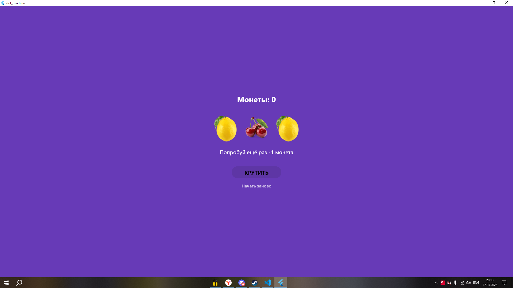

# 🎰 Лабораторная работа №6. Flutter: StatefulWidget и управление состоянием

Разработка приложения «Слот-машина» с изучением принципов работы с состоянием, локальными ресурсами и асинхронными анимациями во Flutter.

## 👤 Информация об авторе
- **ФИО:** Шапкин
- **Группа:** ИСП-232
- **Дата сдачи:** 12.05.2026

## 📚 Что изучили
1. **StatefulWidget vs StatelessWidget** — поняли, зачем нужен объект `State`, как он хранит изменяемые данные и почему `build()` должен находиться именно в нём.
2. **Механизм `setState()`** — научились правильно вызывать перерисовку интерфейса, понимать жизненный цикл виджета и избегать лишних обновлений дерева.
3. **Работа с локальными assets** — изучили регистрацию изображений в `pubspec.yaml`, понимание отступов в YAML и использование `Image.asset()` вместо сетевых запросов.
4. **Управление состоянием UI** — освоили паттерны блокировки кнопок (`onPressed: null`), раннего выхода из методов (`return`), условного рендеринга и выноса повторяющейся логики в отдельные переиспользуемые виджеты с `required` параметрами.
5. **Асинхронные анимации и имитация задержек** — применили `async/await` для пошагового вращения барабанов, добавили плавные переходы через `AnimatedOpacity` и `AnimatedSwitcher`, научились управлять флагами состояния (`_isSpinning`) для защиты от повторных нажатий.

## 🖼 Скриншот финального приложения

## 🚀 Инструкция по запуску
1. `git clone <URL_вашего_репозитория>`
2. `cd slot_machine`
3. `flutter pub get`
4. `flutter run -d chrome`
